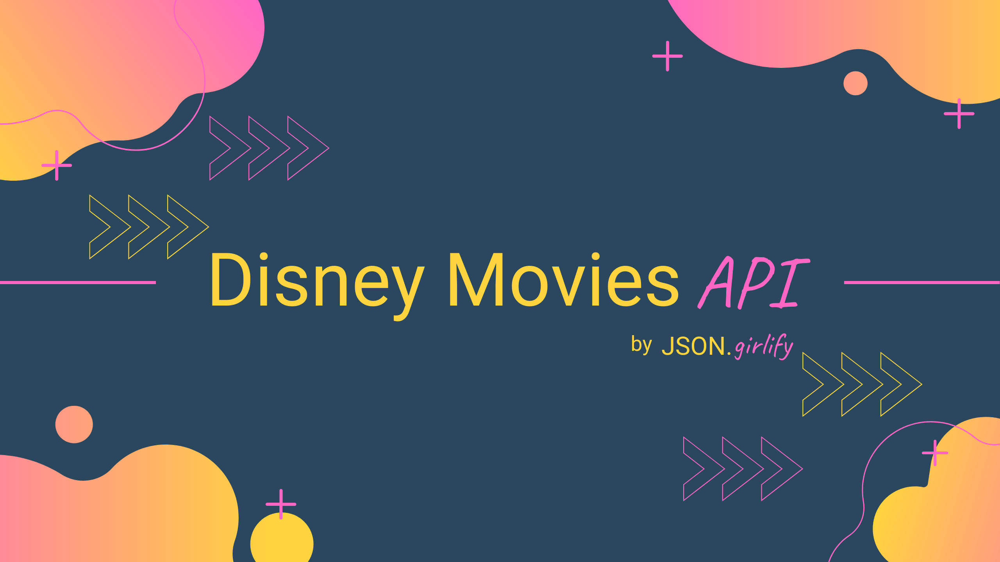
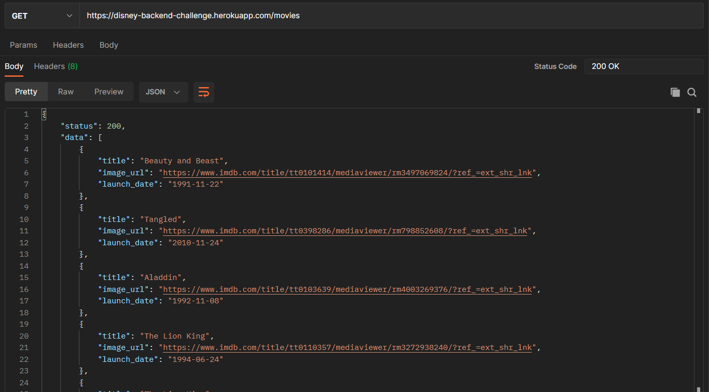

# DISNEY MOVIES API 🚀

[Link to Disney API](https://disney-backend-challenge.herokuapp.com/)

Proyecto desarrollado en el marco de Alkemy Campus Challenge.
El objetivo del mismo fue desarrollar una API que devuelva las peliculas/series de Disney como así también sus personajes.

Para llevarlo a cabo se utilizó **NodeJS**, **Express** y se diagramó la base de datos en **MySQL**. Los campos fueron validados con **Express-validator** y el token de acceso es gestionado a través de **JWT**.

Si bien no es el primer CRUD que he creado, este proyecto presentó un nuevo desafío para mi ya que me propuse hacerlo mejorando mi código tanto en la legibilidad del mismo como en la escalabilidad. 
También busqué aprovechar lo más posible la modularización del código para así hacerlo más eficiente.

Utilizar tacnologías como **Sendgrid** y JWT fue totalmente nuevo para mi. Y si bien sabía crear tablas pivot, nunca había tenido la oportunidad de implementarlas.

# Preview

# Tabla de contenidos

- [Disney Movies API](#disney-movies-api-🚀)
- [Preview](#preview)
- [Tabla de contenidos](#tabla-de-contenidos)
- [Instalacion](#instalacion)
- [Uso](#uso)
- [Documentacion](#documentacion)
- [Footer](#footer)

# Instalacion
[(Subir)](#tabla-de-contenidos)

Si quieres bajar este proyecto a tu dispositivo, puedes seguir los siguientes pasos. Sino, el mismo esta subido a Heroku para que puedas acceder a el sin necesidad de instalar nada.

`$ git init`

`$ git clone https://github.com/honeybadger2788/backendChallenge.git`

`$ npm i`

`$ npm start`

**Recuerda configurar las variables de entorno tal como se muestra en el ***env.example*****

# Uso

Lo primero que debes hacer para comenzar a utilizar esta API es registrarte a traves del siguiente link, utilizando **Postman** o alguna herramienta similar:

👉 <https://disney-backend-challenge.herokuapp.com/auth/register>

Se te pedira un mail y una contraseña de entre 8 y 16 caracteres.

Una vez registrado, podras loguearte para obtener tu token de acceso.

👉 <https://disney-backend-challenge.herokuapp.com/auth/login>

No te olvides de copiar tu token! Este tendra una validez de 1 hora pero no te preocupes. Una vez expirado, podras volver a loguearte para obtener uno nuevo.

# Documentacion

[(Subir)](#tabla-de-contenidos)

La documentacion fue realizada con Postman. En el link de abajo tendras acceso a la misma y alli encontraras tanto los endponints como los campos necesarios para utilizarla.

[📑 Link to Documentation](https://documenter.getpostman.com/view/14968889/UVkqrZxu)

# Footer

[(Subir)](#tabla-de-contenidos)

Gracias por llegar hasta aqui! Si quieres hacerme alguna recomendacion o simplemente contactarte conmigo, puedes hacerlo por cualquiera de estos medios:

- [CV online](https://honeybadger2788.github.io/newCV/)
- [Twitter](https://twitter.com/JGirlify)
- [LinkedIn](https://www.linkedin.com/in/noeliabcarosella/)
- [Mail](noe.carosella@gmail.com)